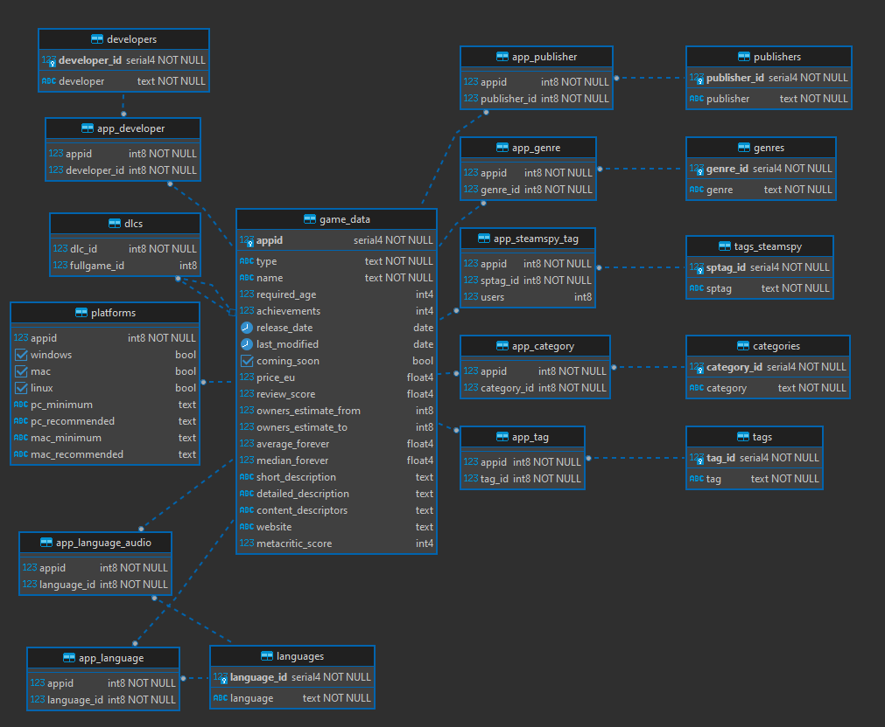

# Тренировочный проект по PostgreSQL. Источник - БД на базе датасета игр из проекта [Steam](https://github.com/ilkar399/steam_analysis)

## Структура и схема базы данных 

* Использованный датасет - [Steam Games and DLCs Dataset](https://www.kaggle.com/datasets/mikekzan/steam-games-dlcs)
* База данных PostgreSQL, нормализованная, с импортом данных из датасета

### ER-диаграмма базы данных



### Таблицы

#### game_data

Основная таблица с игровыми данными

| Поле                 | Тип      | Nullable | Key     | Описание                         |
| -------------------- | -------- | -------- | ------- | -------------------------------- |
| appid                | int      | False    | Primary | appid                            |
| type                 | string   | False    |         | application type (game/dlc/etc)  |
| name                 | string   | False    |         | application name                 |
| required_age         | int      | True     |         | minimum required age             |
| achievements         | int      | True     |         | number of achievements           |
| release_date         | datetime | True     |         | release date                     |
| last_modified        | datetime | False    |         | last modified date               |
| coming_soon          | boolean  | False    |         | is released                      |
| price_eu             | float64  | True     |         | price in eu for european region  |
| review_score         | float64  | True     |         | normalized review score          |
| metacritic_score     | float64  | True     |         | Metacritic review score          |
| owners_estimate_from | int      | True     |         | Estimated owners from (SteamSpy) |
| owners_estimate_to   | int      | True     |         | Estimated owners to (SteamSpy)   |
| average_forever      | float64  | True     |         | average playtime                 |
| median_forever       | float64  | True     |         | median playtime                  |
| short_description    | string   | True     |         | Short game description           |
| detailed_description | string   | True     |         | Detailed game description        |
| content_descriptors  | string   | True     |         | Rated content description        |
| website              | string   | True     |         | Game website                     |


#### dlcs

DLC к играм

| Поле        | Тип | Nullable | Key             | Описание         |
| ----------- | --- | -------- | --------------- | ---------------- |
| dlc_id      | int | False    | game_data.appid | DLC App ID       |
| fullgame_id | int | False    | game_data.appid | Main game App ID |

#### app_language

| Поле        | Тип | Nullable | Key                   | Описание    |
| ----------- | --- | -------- | --------------------- | ----------- |
| appid       | int | False    | game_data.appid       | App ID      |
| language_id | int | False    | languages.language_id | Language ID |

#### app_language_audio

| Поле        | Тип | Nullable | Key | Описание    |
| ----------- | --- | -------- | --- | ----------- |
| appid       | int | False    |     | App ID      |
| language_id | int | False    |     | Language ID |

#### languages
| Поле        | Тип    | Nullable | Key     | Описание    |
| ----------- | ------ | -------- | ------- | ----------- |
| language_id | int    | False    | Primary | Language ID |
| language    | string | False    |         | Language    |


#### app_developer

| Поле         | Тип | Nullable | Key                     | Описание     |
| ------------ | --- | -------- | ----------------------- | ------------ |
| appid        | int | False    | game_data.appid         | App ID       |
| developer_id | int | False    | developers.developer_id | Developer ID |

#### developers

| Поле         | Тип    | Nullable | Key     | Описание     |
| ------------ | ------ | -------- | ------- | ------------ |
| developer_id | int    | False    | Primary | Developer ID |
| developer    | string | False    |         | Developer    |

#### app_publisher

| Поле         | Тип | Nullable | Key                     | Описание     |
| ------------ | --- | -------- | ----------------------- | ------------ |
| appid        | int | False    | game_data.appid         | App ID       |
| publisher_id | int | False    | publishers.publisher_id | Publisher ID |

#### publishers

| Поле         | Тип    | Nullable | Key     | Описание     |
| ------------ | ------ | -------- | ------- | ------------ |
| publisher_id | int    | False    | Primary | Publisher ID |
| publisher    | string | False    |         | Publisher    |

#### platforms
| Поле            | Тип     | Nullable | Key     | Описание |
| --------------- | ------- | -------- | ------- | -------- |
| appid           | int     | False    | Primary | App ID   |
| windows         | boolean | False    |         |          |
| mac             | boolean | False    |         |          |
| linux           | boolean | False    |         |          |
| pc_minimum      | string  | True     |         |          |
| pc_recommended  | string  | True     |         |          |
| mac_minimum     | string  | True     |         |          |
| mac_recommended | string  | True     |         |          |

#### app_category
| Поле        | Тип | Nullable | Key                    | Описание    |
| ----------- | --- | -------- | ---------------------- | ----------- |
| appid       | int | False    | game_data.appid        | App ID      |
| category_id | int | False    | categories.category_id | Category ID |

#### categories
| Поле        | Тип    | Nullable | Key     | Описание    |
| ----------- | ------ | -------- | ------- | ----------- |
| category_id | int    | False    | Primary | Category ID |
| category    | string | False    |         | Category    |

#### app_genre
| Поле     | Тип | Nullable | Key             | Описание |
| -------- | --- | -------- | --------------- | -------- |
| appid    | int | False    | game_data.appid | App ID   |
| genre_id | int | False    | genres.genre_id | Genre ID |

#### genres
| Поле     | Тип    | Nullable | Key     | Описание |
| -------- | ------ | -------- | ------- | -------- |
| genre_id | int    | False    | Primary | Genre ID |
| genre    | string | False    |         | Genre    |

#### app_tag
| Поле   | Тип | Nullable | Key             | Описание |
| ------ | --- | -------- | --------------- | -------- |
| appid  | int | False    | game_data.appid | App ID   |
| tag_id | int | False    | tags.tag_id     | Tag ID   |

#### tags
| Поле   | Тип    | Nullable | Key     | Описание |
| ------ | ------ | -------- | ------- | -------- |
| tag_id | int    | False    | Primary | Tag ID   |
| tag    | string | False    |         | Tag      |

#### app_steamspy_tag
| Поле     | Тип | Nullable | Key                    | Описание                   |
| -------- | --- | -------- | ---------------------- | -------------------------- |
| appid    | int | False    | game_data.appid        | App ID                     |
| sptag_id | int | False    | tags_steamspy.sptag_id | SteamSpy Tag ID            |
| users    | int | False    |                        | Number of users with a tag |


#### tags_steamspy
| Поле     | Тип    | Nullable | Key     | Описание        |
| -------- | ------ | -------- | ------- | --------------- |
| sptag_id | int    | False    | Primary | SteamSpy Tag ID |
| sptag    | string | False    |         |                 |

## Примеры запросов

### Базовые запросы

#### Топ-10 игр по отзывам, вышедших в 2022 году

```sql
SELECT name,
       review_score,
       COALESCE (metacritic_score, 0) AS metacritic_score,
       owners_estimate_from,
       owners_estimate_to
  FROM game_data
 WHERE type = 'game'
       AND release_date >= '2022-01-01'
 ORDER BY review_score DESC
 LIMIT 10
```

#### Топ-10 игр по оцениваему числу владельцев, вышедших в 2022 году

```sql
SELECT name,
       review_score,
       COALESCE (metacritic_score, 0) AS metacritic_score,
       owners_estimate_from,
       owners_estimate_to
  FROM game_data
 WHERE type = 'game'
       AND release_date >= '2022-01-01'
       AND release_date  < '2023-01-01'
       AND coming_soon<>TRUE  
 ORDER BY COALESCE (owners_estimate_from, 0) DESC
 LIMIT 10
```

#### Топ-5 игр по оцениваемой выручке, вышедших в 2022 году

```sql
SELECT name,
       review_score,
       ROUND(COALESCE(price_eu, 0.0)::NUMERIC, 2) AS price_eu,
       COALESCE (metacritic_score, 0) AS metacritic_score,
       ROUND((COALESCE(owners_estimate_from, 0) * COALESCE(price_eu, 0))::NUMERIC, 2) AS estimated_revenue_from,
       ROUND((COALESCE(owners_estimate_to, 0) * COALESCE(price_eu, 0))::NUMERIC, 2) AS estimated_revenue_to,
       owners_estimate_to
  FROM game_data
 WHERE type = 'game'
       AND release_date >= '2022-01-01'
       AND release_date  < '2023-01-01'
       AND coming_soon<>TRUE  
 ORDER BY COALESCE(owners_estimate_from, 0) * COALESCE(price_eu, 0) DESC
 LIMIT 10
```


### JOIN'ы

#### Топ-20 тегов по данным SteamSpy

```sql
    SELECT sptag AS SteamSpy_Tag,
           COUNT(users) AS tags_count
    FROM tags_steamspy t
    INNER JOIN app_steamspy_tag at ON t.sptag_id = at.sptag_id
    GROUP BY sptag
    ORDER BY COUNT(users) DESC
    LIMIT 20
```

#### Топ-20 тегов (по данным Steam) для игр с рейтингом >= 9

```sql
    SELECT t.tag AS Steam_Tag,
           COUNT(DISTINCT gd.appid) AS Games_count
    FROM (
        SELECT appid 
        FROM game_data 
        WHERE review_score >= 9.0 
              AND type='game') gd
    INNER JOIN app_tag at ON gd.appid=at.appid
    INNER JOIN tags t ON at.tag_id=t.tag_id
    GROUP BY t.tag_id
    ORDER BY COUNT(DISTINCT gd.appid) DESC
    LIMIT 20
```

#### Топ-5 жанров для игр с рейтингом Metacritic score >= 90

```sql
    SELECT g.genre Genre,
           COUNT(DISTINCT gd.appid) AS Games_count
    FROM    (
            SELECT appid 
            FROM game_data 
            WHERE metacritic_score >= 90 
            AND type = 'game'
            ) gd
    INNER JOIN app_genre ag ON gd.appid=ag.appid
    INNER JOIN genres g ON ag.genre_id=g.genre_id
    GROUP BY g.genre_id
    ORDER BY COUNT(DISTINCT gd.appid) DESC
    LIMIT 5
```

### CTE и Оконные функции

#### Игры от разработчиков, сделавших более одной игры со средним рейтингом >= 9.0 по всем играм разработчика

```sql
    WITH cte AS (
        SELECT   gd.appid,
                 name,
                 review_score,
                 release_date,
                 developer
        FROM        (
                    SELECT appid, name, review_score, release_date 
                    FROM game_data 
                    WHERE type='game'
                    ) gd
        INNER JOIN app_developer ad ON gd.appid=ad.appid
        INNER JOIN developers d ON ad.developer_id=d.developer_id
    ),
    cte2 AS (
        SELECT *,
               AVG(review_score) OVER (PARTITION BY developer) AS avg_review_score,
               COUNT(appid) OVER (PARTITION BY developer) AS games_count
        FROM cte
    )
    SELECT * 
    FROM cte2
    WHERE avg_review_score >= 9.0
          AND games_count > 1
    ORDER BY developer ASC, release_date DESC
```

#### Вышедшие в 2022 году игры от издателей, выпустивших в Steam более 10 игр в 2022 году, с числом и суммарной стоимостью DLC для них


```sql

     WITH cte_dlcs AS (
        SELECT d.fullgame_id AS fullgame_id,
               COUNT(DISTINCT d.dlc_id) AS dlcs_count,
               SUM(price_eu) AS dlcs_price,
               AVG(review_score) AS dlcs_review_score
        FROM game_data gd
        INNER JOIN dlcs d ON gd.appid = d.dlc_id  
        WHERE release_date >= '2022-01-01'
              AND release_date  < '2023-01-01'
              AND coming_soon<>TRUE  
        GROUP BY d.fullgame_id 
    ),
    cte_publishers AS (
    	SELECT gd.appid,
    		   gd.name,
    		   gd.review_score,
    		   gd.release_date,
    		   gd.price_eu,
    		   gd.owners_estimate_from,
    		   gd.owners_estimate_to,
    		   publisher,
    		   COUNT(gd.appid) OVER (PARTITION BY publisher) AS publisher_games,
    		   SUM(gd.owners_estimate_from) OVER (PARTITION BY publisher) AS publisher_owners
    	FROM (
                SELECT appid,
                	   name,
                	   review_score,
                	   release_date,
                	   price_eu,
                	   owners_estimate_from,
                	   owners_estimate_to
                FROM game_data 
                WHERE type='game'
                	  AND release_date  >= '2022-01-01'
                	  AND release_date  < '2023-01-01'
                	  AND coming_soon<>TRUE  
             ) gd
        INNER JOIN app_publisher ap ON gd.appid = ap.appid 
        INNER JOIN publishers p ON ap.publisher_id = p.publisher_id
    )
    SELECT cp.appid,
    	   name,
    	   review_score review_score,
    	   release_date,
    	   publisher,
    	   ROUND(price_eu::NUMERIC, 2) AS price_eu,
    	   owners_estimate_from,
    	   owners_estimate_to,
    	   COALESCE (cd.dlcs_count, 0) AS dlcs_count,
    	   ROUND(COALESCE(cd.dlcs_price, 0)::NUMERIC) AS dlcs_price,
    	   ROUND(COALESCE (cd.dlcs_review_score, 0)::NUMERIC) AS dlcs_avg_review_score
    FROM cte_publishers cp
    LEFT JOIN cte_dlcs cd ON cp.appid = cd.fullgame_id
    WHERE cp.publisher_games > 10
    ORDER BY publisher_owners DESC, publisher ASC

```
